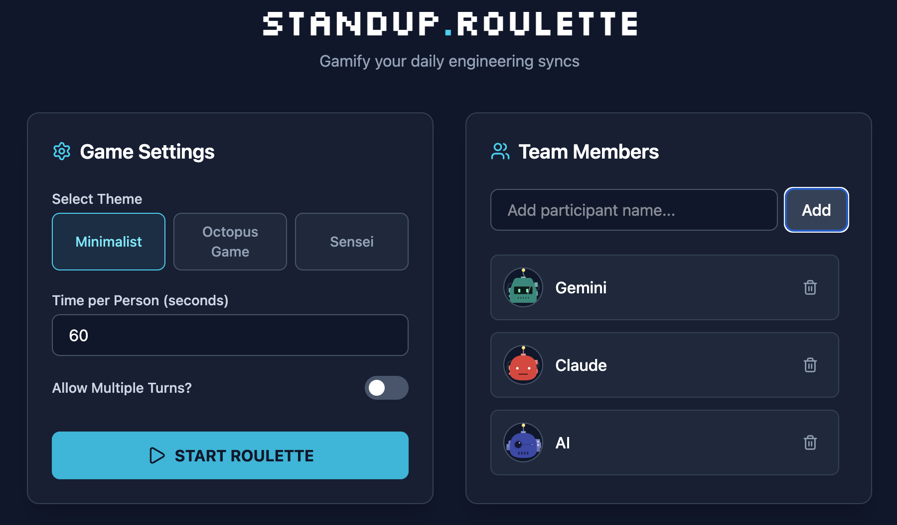
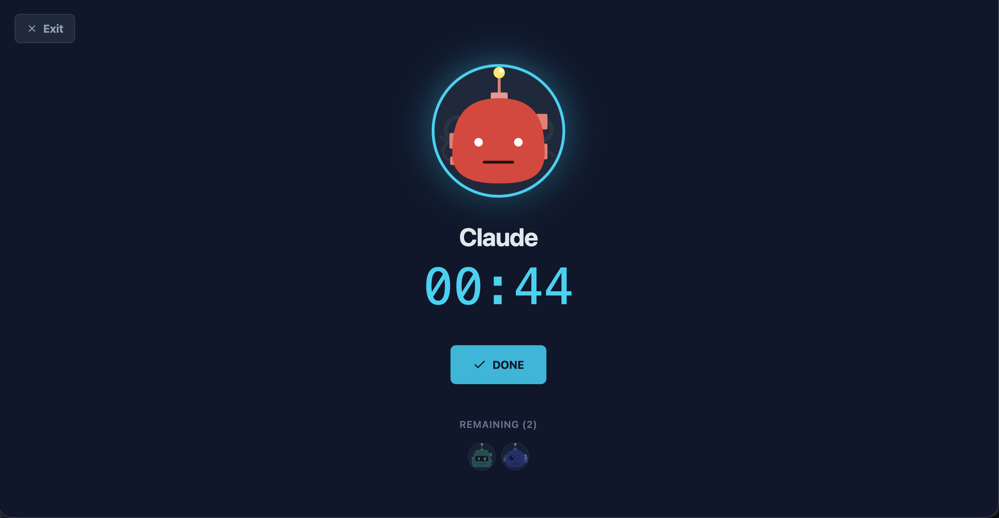
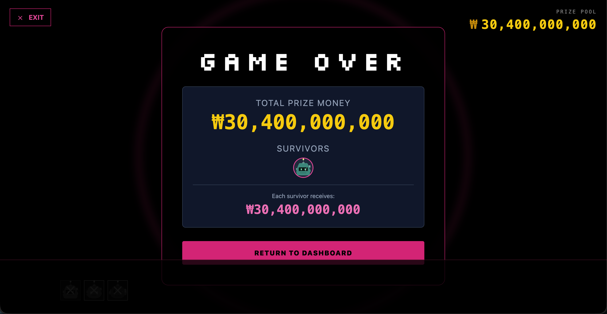

# Standup Roulette

A gamified standup meeting timer that adds excitement and structure to your daily engineering syncs. Transform boring standup meetings into engaging experiences with themes, timers, and elimination mechanics.

## Features

- **Multiple Themes**: Choose from different visual themes including Base, Classroom, and Squid Game
- **Random Participant Selection**: Fairly selects team members to speak next
- **Time Limits**: Set time limits per person with visual countdown timers
- **Elimination Mechanics**: In themed modes, participants who don't finish in time get "eliminated"
- **Prize Pool Tracking**: Track accumulated "prizes" in Squid Game mode
- **Flexible Settings**: Configure time limits, theme selection, and whether participants can speak multiple times
- **Responsive Design**: Works on desktop and mobile devices
- **Persistent State**: Saves your team and settings in browser localStorage

## Screenshots

### Dashboard

*The main dashboard where you add team members and configure game settings.*

### Base Theme - Active Speaker

*Clean, minimalist theme showing the active speaker with countdown timer.*

### Squid Game Theme

*High-stakes Squid Game theme with elimination mechanics and prize pool tracking.*

### Game Complete

*End screen showing meeting completion and participant status.*

## Quick Start

### Clone the Project

```bash
git clone https://github.com/yourusername/standup-roulette.git
cd standup-roulette
```

### Install Dependencies

```bash
npm install
```

### Run Local Development Server

```bash
npm run dev
```

The application will be available at `http://localhost:5173` (or the port shown in your terminal).

## How to Use

1. **Add Team Members**: Enter participant names in the Team Members section
2. **Configure Settings**:
   - Select your preferred theme
   - Set time limit per person (0 for unlimited time)
   - Choose whether participants can speak multiple times
3. **Start the Meeting**: Click "START ROULETTE" to begin
4. **Run the Standup**: The app will randomly select participants and start their timers
5. **Manage Turns**: Use the controls to skip, eliminate, or mark participants as done

## Themes (Skins)

Standup Roulette supports multiple visual themes that change the entire experience:

### Available Themes

- **Base Theme**: Clean, minimalist design with cyan accents on dark slate background
- **Classroom Theme**: Educational feel with structured layouts
- **Squid Game Theme**: High-stakes gamification with elimination mechanics, prize pool tracking, and dramatic visual effects

### How to Add Additional Skins

To add a new theme/skin to the application:

1. **Create a new theme component** in `src/themes/`:
   ```vue
   <!-- src/themes/YourThemeName.vue -->
   <template>
     <div class="your-theme-styles">
       <!-- Your theme implementation -->
     </div>
   </template>

   <script setup>
   // Import necessary composables and components
   import { /* imports */ } from 'vue'
   import useStandup from '../composables/useStandup'

   const {
     participants,
     settings,
     appState,
     turnState,
     activeParticipant,
     timeRemaining,
     survivors,
     prizeMoney,
     stopMeeting,
     // ... other functions
   } = useStandup()
   </script>
   ```

2. **Add the theme to the ThemeProvider**:
   - Open `src/components/ThemeProvider.vue`
   - Import your new theme component
   - Add it to the theme mapping object

3. **Update the Dashboard**:
   - Open `src/components/Dashboard.vue`
   - Add your theme to the `availableThemes` array with an `id` and `name`

4. **Theme Structure Guidelines**:
   - Handle all app states: `'running'`, `'finished'`
   - Include exit button functionality
   - Display active participant with avatar and name
   - Show timer when active
   - Implement turn controls (start, skip, eliminate, done)
   - Show game completion screen with survivors
   - Use consistent styling with the app's design system

### Theme Development Tips

- Use Vue 3 Composition API with `<script setup>`
- Leverage the `useStandup` composable for all game state
- Follow the existing theme patterns for consistency
- Test with different screen sizes and participant counts
- Include proper accessibility features

## Technologies Used

- **Vue 3**: Progressive JavaScript framework
- **Vite**: Fast build tool and development server
- **Tailwind CSS**: Utility-first CSS framework
- **Lucide Icons**: Beautiful icon library

## Contributing

Contributions are welcome! Please feel free to submit a Pull Request.

## License

This project is licensed under the MIT License - see the [LICENSE](LICENSE) file for details.
